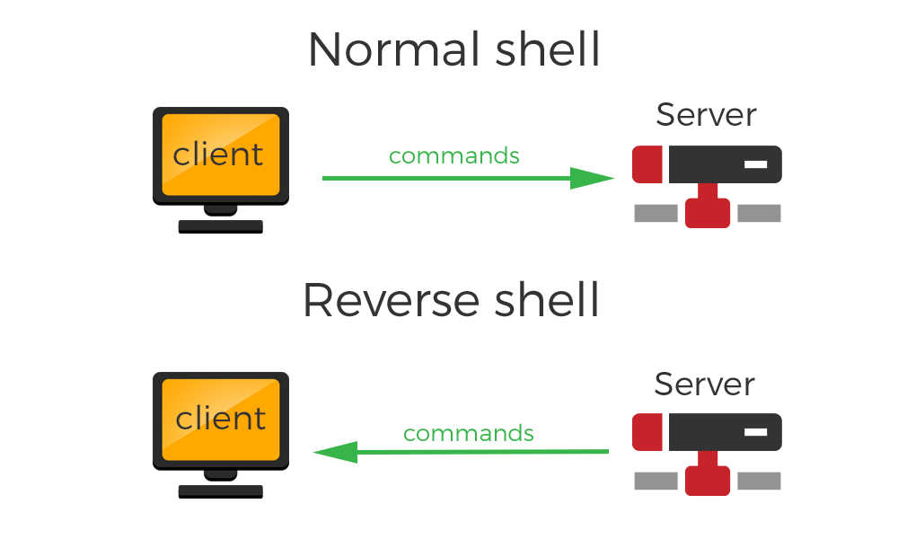

# Reverse Shell
A reverse shell is a type of shell in which the target machine communicates back to the attacking machine. The attacking machine has a listener port on which it receives the connection, which by using, code or command execution is achieved.

## How a Reverse Shell works?
To establish a typical remote shell, a machine controlled by the attacker connects to a remote network host and requests a shell session – this is called a bind shell. But what if the remote host is not directly accessible, for example because it has no public IP or is protected by a firewall? In this situation, a reverse shell might be used, where the target machine initiates an outgoing connection to a listening network host and a shell session is established.

